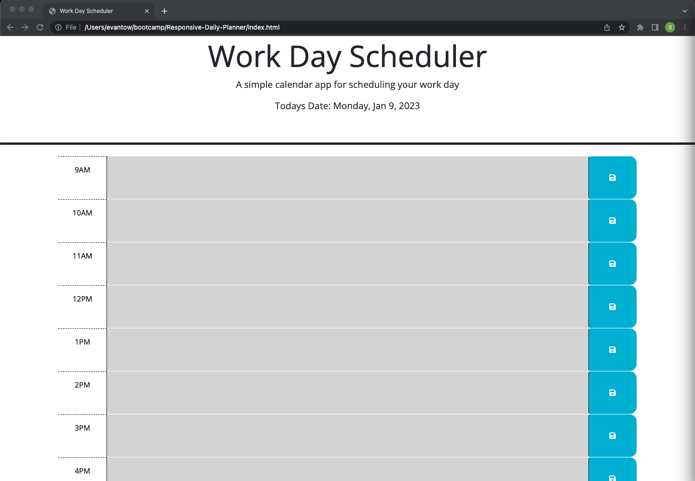

# <Your-Project-Title>

## Description
This is a responsive work day scheduler application that displays the current date and the top of the screen as well as time blocks from 9am-5pm that have text fields for the user to enter and save any useful information as a reminder. The time blocks are color coordinated to show wether that time block is in the past, present, or future.
The time blocks also contain a save button that allows the user to save their text input for a specific hour to local storage allowing the text to remain displayed even if the page is refreshed. This application was built to help the user better manage things-to-do or events they have planned for any given work day.

Deployed Application Link: 

## Table of Contents (Optional)
N/A

## Installation
N/A

## Usage
To use this application simply input any text you would like into the desired time block by clicking and typing a message.

If the user would like to save this text they can simply press the blue save button on the right hand side of the desired timeblock.

If the user would like to clear the text they will have to manually click the time block and delete the text and press the save button again.

## Credits
Recieved starter code from this repository: 
https://github.com/coding-boot-camp/crispy-octo-meme

Collaborators:
Georgeyoo - https://github.com/Georgeyoo
mfyke - https://github.com/mfyke
cmanthena2u - https://github.com/cmathena2u

## License
MIT License

Copyright (c) [2022] [Evan Towlerton]

Permission is hereby granted, free of charge, to any person obtaining a copy of this software and associated documentation files (the "Software"), to deal in the Software without restriction, including without limitation the rights to use, copy, modify, merge, publish, distribute, sublicense, and/or sell copies of the Software, and to permit persons to whom the Software is furnished to do so, subject to the following conditions:

The above copyright notice and this permission notice shall be included in all copies or substantial portions of the Software.

THE SOFTWARE IS PROVIDED "AS IS", WITHOUT WARRANTY OF ANY KIND, EXPRESS OR IMPLIED, INCLUDING BUT NOT LIMITED TO THE WARRANTIES OF MERCHANTABILITY, FITNESS FOR A PARTICULAR PURPOSE AND NONINFRINGEMENT. IN NO EVENT SHALL THE AUTHORS OR COPYRIGHT HOLDERS BE LIABLE FOR ANY CLAIM, DAMAGES OR OTHER LIABILITY, WHETHER IN AN ACTION OF CONTRACT, TORT OR OTHERWISE, ARISING FROM, OUT OF OR IN CONNECTION WITH THE SOFTWARE OR THE USE OR OTHER DEALINGS IN THE SOFTWARE.

## Badges
N/A

## Features
Ability to save any text that is input into timeblock by pressing the blue save button.

## How to Contribute
The application could use a clear text input button so the user does not have to manually clear the text input and resave it.

The application could probably be improved by changing how the timeblock takes and displays data. For example what if you would like to add more then one event to any given timeblock. Potentially fix this by manipulating the dom to create and append new events to a single time block. 

## Tests
N/A